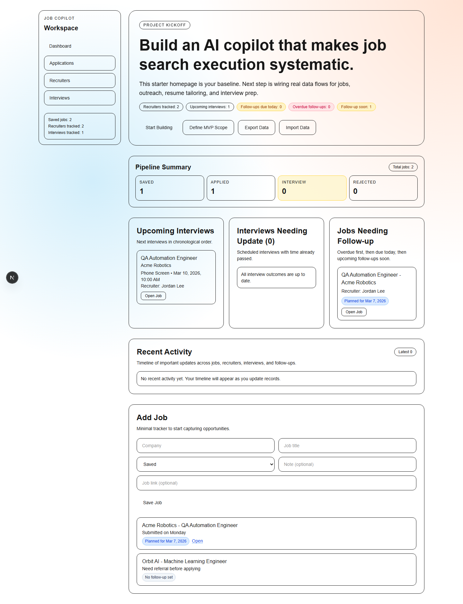
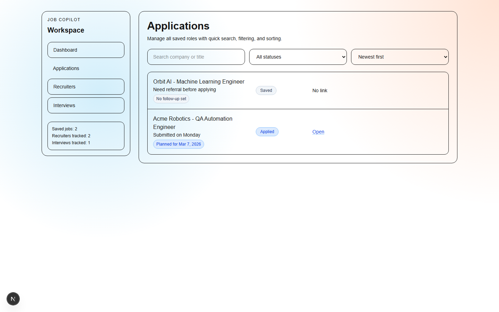
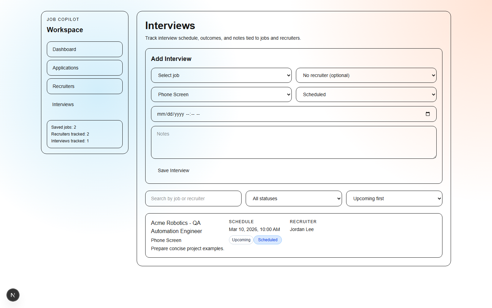

# Job Search Copilot

[](https://github.com/AliaksandrHv/ai-job-search-app/actions/workflows/e2e-playwright.yml)
[](https://github.com/AliaksandrHv/ai-job-search-app/actions/workflows/e2e-playwright.yml)
[](https://ai-job-search-app.vercel.app)
[](https://github.com/AliaksandrHv/ai-job-search-app)


A local-first job search management app built with Next.js, React, and Tailwind, with AI copilot architecture implemented and disabled by default.

The product is designed to support a practical end-to-end workflow:

Jobs -> Recruiters -> Interviews -> Follow-ups -> Activity Timeline -> Insights -> Backup/Restore

## Live Demo

https://ai-job-search-app.vercel.app

## Repository

https://github.com/AliaksandrHv/ai-job-search-app

## Changelog

See [CHANGELOG.md](CHANGELOG.md) for release history and semantic versioning notes.

## Demo

- Live app: https://ai-job-search-app.vercel.app
- Walkthrough video (YouTube): https://youtu.be/myvHFwZlb8s

Suggested walkthrough order:

1. Open dashboard
2. Add a job
3. Edit the job
4. Delete a job
5. Show filtering and search
6. Show recruiter tracking
7. Refresh to confirm persistence

## Problem

Managing job applications across multiple companies can become scattered and hard to track.
This project was built to provide one operational dashboard for applications, recruiters,
interviews, follow-ups, and recent activity.

## Screenshots

### Dashboard


### Applications


### Interviews


## MVP Features

### Jobs
- Add, edit, delete jobs
- Required validation for company and title
- Status tracking (`Saved`, `Applied`, `Interview`, `Rejected`)
- Optional job link support
- Follow-up fields and actions

### Recruiters
- Add, edit, delete recruiter contacts
- Search and sort recruiters
- Track contact dates and next follow-up
- Link/unlink recruiter to a job

### Interviews
- Add, edit, delete interviews
- Link interviews to jobs and optionally recruiters
- Status tracking (`Scheduled`, `Completed`, `Cancelled`)
- Filters, search, and sort modes
- "Needs outcome update" detection for past scheduled interviews

### Follow-ups
- Job-level follow-up status and dates
- Quick actions:
  - set/reschedule follow-up
  - mark contacted today
  - mark follow-up done
  - clear follow-up
- Dashboard cards for due/overdue visibility

### Activity Timeline
- Auto-logs key product actions
- Dashboard "Recent Activity" widget
- Job Details and Recruiter Details timelines
- Persists in localStorage with cap to avoid unbounded growth

### Backup / Restore
- Export full app data to JSON
- Import JSON backup with validation and overwrite confirmation
- Immediate UI refresh after successful restore

### AI Copilot
- Feature-flagged AI service layer and secure server routes
- Job description summarizer
- Smart job notes generator
- Follow-up message generator
- Disabled by default in the public build to avoid API cost

## Tech Stack

- Next.js 16 (App Router)
- React 19
- TypeScript
- Tailwind CSS v4
- localStorage persistence
- Next.js server routes for optional AI requests

## Tech Decisions

- Next.js: fast product iteration with a production-ready framework
- Tailwind CSS: rapid UI development with consistent design primitives
- localStorage: simple persistence for MVP speed and offline-friendly behavior
- Playwright: end-to-end coverage for core user flows

## Architecture Overview

Current implementation is intentionally single-page and local-first:

- Main UI and state orchestration: `app/page.tsx`
- Global styles/theme tokens: `app/globals.css`
- App shell metadata: `app/layout.tsx`
- AI routes and provider layer: `app/api/ai/*`, `lib/ai/*`

System view:

```text
User
  -> Next.js Frontend
    -> React State
      -> localStorage
    -> AI Feature Flag
      -> Next.js AI Routes
        -> OpenAI API (optional, disabled by default)
```

Data lifecycle:

1. Hydrate state from localStorage on app load
2. Normalize records to keep backward compatibility
3. Persist each entity set through dedicated `useEffect` syncs
4. Render views (Dashboard, Applications, Recruiters, Interviews)
5. Optionally call AI routes for summaries, notes, and follow-ups when enabled
6. Open detail/edit panels for focused record operations

## Data Model (MVP)

### Job
- `id`
- `company`
- `title`
- `status`
- `note`
- `jobDescription?`
- `jobLink?`
- `linkedRecruiterId?`
- `nextFollowUpDate?`
- `lastContactDate?`
- `followUpStatus?`
- `aiSummary?`
- `aiNotes?`
- `aiFollowUpSuggestion?`
- `aiUpdatedAt?`
- `createdAt?`

### Recruiter
- `id`
- `name`
- `company`
- `role`
- `email`
- `profileLink?`
- `notes`
- `lastContactDate?`
- `nextFollowUpDate?`
- `createdAt?`

### Interview
- `id`
- `jobId`
- `recruiterId?`
- `interviewType`
- `status`
- `scheduledAt`
- `notes`
- `createdAt?`
- `updatedAt?`

### ActivityEvent
- `id`
- `type`
- `timestamp`
- `message`
- `jobId?`
- `recruiterId?`
- `interviewId?`

## Persistence Keys

- `ai_job_search_jobs_v1`
- `ai_job_search_recruiters_v1`
- `ai_job_search_interviews_v1`
- `ai_job_search_activity_v1`

## AI Configuration

- Feature flag: `NEXT_PUBLIC_FEATURE_AI_COPILOT`
- Provider secret: `OPENAI_API_KEY`
- Default behavior: AI stays hidden and inactive unless explicitly enabled
- Security: AI requests run through `app/api/ai/*`; the API key is never exposed client-side

## Run Locally

```bash
npm install
npm run dev
```

Open `http://localhost:3000`.

## Available Scripts

```bash
npm run dev
npm run lint
npm run build
npm run start
```

## Testing

End-to-end tests are implemented using Playwright.

Run tests locally:

```bash
npm run test:e2e
```

Covered flows:

- Add job
- Edit job
- Delete job
- Search jobs
- Filter by status

CI automation:

- GitHub Actions workflow: `.github/workflows/e2e-playwright.yml`
- Runs on every push and pull request to `main`
- Uploads Playwright artifacts (`playwright-report/` and `test-results/`)
- Includes recorded browser sessions as test video artifacts

## Roadmap

v1.1
- backend persistence and authentication
- shared data across devices

v1.2
- resume vs job match scoring
- interview question generation support

v1.3
- recruiter follow-up reminders
- deeper analytics and trend tracking

## Project Structure (Current)

```text
app/
  api/ai/
  globals.css
  layout.tsx
  page.tsx
components/
  ai/
config/
  features.ts
lib/
  ai/
```

## Portfolio Notes

This project demonstrates:

- Product-driven feature sequencing from MVP to usability polish
- Strong local data modeling and backward-compatible persistence
- Connected workflow across entities (jobs, recruiters, interviews, follow-ups)
- Operational UX (dashboard insights, details panels, quick actions)
- Feature-flagged AI architecture with server-side provider isolation
- Practical data portability via JSON backup/restore

## MVP Status

MVP is complete and functional as a standalone local-first product.

Potential next iterations:

- Modular code split (`components/`, `hooks/`, `lib/`, `types/`)
- richer keyboard shortcuts
- priority/pinned jobs
- enhanced analytics widgets
